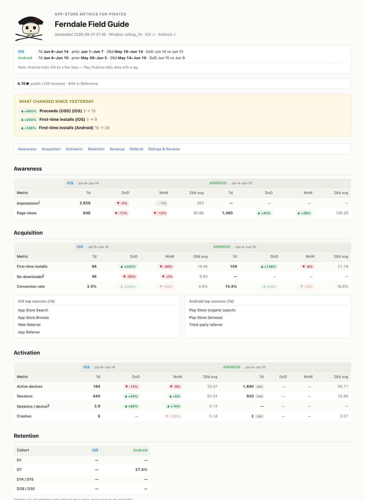

# `/aaarrr` — App-store metrics, for pirates

🏴‍☠️ Daily **AAARRR** (Awareness, Acquisition, Activation, Retention, Revenue, Referral) report for your app, pulled from **App Store Connect**, the public **apps.apple.com** page, and **Google Play Console**.

Claude drives the [Claude in Chrome](https://claude.ai/chrome) extension to read your already-signed-in dashboards — no API keys, no OAuth setup, no credentials shared. Your sessions never leave your machine.

Reports lead with rolling-7d numbers, day-over-day and week-over-week deltas, and a 28-day baseline. A "what changed since yesterday" callout surfaces the three biggest DoD movers. Output is a single self-contained HTML file with semantic `<table>` markup — pastes cleanly into Notion / Slack / Sheets / Linear. A swashbuckling pirate sits in the top-left by default; pass `--no-pirate` if you want it plain.

## Sample output



The live HTML is at [`samples/sample_report.html`](./samples/sample_report.html). Synthetic data, fictional app name. A pirate-free variant lives at [`samples/sample_report_no_pirate.html`](./samples/sample_report_no_pirate.html).

## Install

```bash
# Inside a clone of the parent skills repo:
ln -s "$(pwd)/aaarrr" ~/.claude/skills/aaarrr
```

Restart Claude Code (`/clear`), then invoke `/aaarrr <YourAppName>`.

## Usage

| Form | What it does |
| --- | --- |
| `/aaarrr` | Asks for the app name, runs both stores. |
| `/aaarrr MyApp` | iOS + Android, rolling-7d window, unified HTML report. |
| `/aaarrr MyApp ios` | App Store Connect + public page only. |
| `/aaarrr MyApp android` | Play Console only. |
| `/aaarrr MyApp --window 30d` | Override window (`7d`, `30d`, `90d`, or `YYYY-MM-DD..YYYY-MM-DD`). |
| `/aaarrr MyApp --refresh` | Force re-fetch even if cache < 1h old. |
| `/aaarrr MyApp --report-only` | Skip the browser entirely; re-render from cached JSON. |
| `/aaarrr MyApp --no-pirate` | Render without the swashbuckler at the top. |

The HTML drops in your current working directory as `aaarrr_<slug>_<YYYYMMDD>.html`. Raw per-store JSON is cached in `reports/` (gitignored — per-user data).

## Requirements

- [Claude in Chrome](https://claude.ai/chrome) extension installed and signed in. App Store Connect and Play Console block other automation surfaces (macOS computer-use treats browsers as tier-"read") — the in-page MCP is the only path that works for clicking.
- Active Chrome session in each store you want data from. The skill detects sign-in state and pauses for you to authenticate; it never types credentials and never handles 2FA itself.
- Node 20+ for the HTML renderer.

## What lands in the report

One section per AAARRR pillar, each as an iOS / Android side-by-side table with **7d · DoD · WoW · 28d-avg** columns and a date-range banner at the top so "7d" is never ambiguous between stores.

- **Awareness** — impressions, store-listing page views.
- **Acquisition** — first-time installs, redownloads, conversion rate, top sources.
- **Activation** — active devices, sessions, sessions/device, crashes.
- **Retention** — D1 / D7 / D14 / D28 cohorts (Play returns D15 / D30 — labelled).
- **Revenue** — proceeds, IAP transactions, active subs, ARPU + yesterday line.
- **Referral** — acquisition-source breakdown per store.
- **Ratings & Reviews** — average, total, new-yesterday, latest 3 reviews per side.

The public apps.apple.com page contributes a one-line strip above the callout: public rating, category rank, Today/Featured presence.

## How Claude reads the dashboards

Two stores, two strategies — both are documented in detail in [`references/selectors.md`](./references/selectors.md):

**iOS** is a single-shot read. App Store Connect exposes an internal JSON endpoint (`/analytics/api/v1/data/time-series`); `asc_private_scrape.js` calls it in parallel for every measure using the cookies in your existing browser session. One round-trip per page, full 28-day series for every metric.

**Android** is two-tier:
- **Tier 1 (fast)** reads plain-text headline numbers from `/grow-overview` — covers all five AAARRR pillars at 28-day grain (device acquisitions, first opens, MAU, 7-day retention, conversion rate) plus their dashboard-reported WoW deltas. ~3K tokens total.
- **Tier 2 (optional)** sweeps individual `<canvas>` charts via real mouse hovers to capture Google's aria-live announcements (`"<date>: <series> is <value>"`). Adds per-day DoD/WoW chips for any chart you want. ~6K tokens per chart.

When the Android side has only Tier 1 data, the renderer promotes the 28d total into the primary cell with a small `(28d)` tag instead of leaving `—` everywhere.

## Known gaps and the limits of dashboard-driven reads

- **Apple retention and active_subs** — the time-series endpoint accepts different parameter names for cohort retention and subscriptions that aren't fully mapped yet. Until mapped, those rows render `—` with footnotes. The verified-vs-unmapped measure list is in [`references/selectors.md`](./references/selectors.md).
- **Android session count and sessions/device** — Play Console doesn't expose these natively. Firebase Analytics is the only complete source.
- **Crash unit mismatch** — Apple reports a crash count; Play reports a crash rate. Each side renders its native unit. The mapping doc spells this out.
- **Referral attribution** — limited to the stores' own source breakdowns. True UTM-level attribution requires an SDK (Firebase, Adjust, etc.) — out of scope.

**For production-grade coverage, the official APIs are the right exit ramp**: the [App Store Connect Analytics Reports API](https://developer.apple.com/help/app-store-connect-analytics/overview/analytics-reports-api/) (JWT-auth, daily report files) and the [Play Developer Reporting API](https://developers.google.com/play/developer/reporting) (OAuth, REST, covers Android Vitals). The browser-driven path is the "get a report tonight without setting up OAuth" path.

## When something breaks

Apple and Google ship dashboard redesigns frequently. When a metric starts reading `—`:

1. Open the dashboard page in Chrome with DevTools → Network.
2. Trigger the metric (load the chart / change the date range).
3. Find the request that returned the number you wanted.
4. Update the matching entry in [`references/selectors.md`](./references/selectors.md) **and** the corresponding `MEASURE` constant in [`scripts/`](./scripts/). The scraper is the source of truth — the reference doc should mirror it.
5. Re-run with `--refresh`.

## Layout

```
aaarrr/
├── SKILL.md                       # what Claude reads at /aaarrr time
├── README.md                      # this file
├── scripts/
│   ├── asc_private_scrape.js      # ASC reader (single-shot IIFE)
│   ├── asc_public_scrape.js       # apps.apple.com page reader
│   ├── play_scrape.js             # Play Console helper library
│   ├── build_report_html.mjs      # Node — merges JSON, emits HTML (default)
│   └── build_report.mjs           # Node — merges JSON, emits Markdown (legacy)
├── references/
│   ├── aaarrr_mapping.md          # pillar ↔ dashboard-field mapping
│   └── selectors.md               # paths, endpoints, hover-sweep technique
├── samples/
│   ├── sample_report.html         # the rendered demo (with pirate)
│   ├── sample_report_no_pirate.html  # the --no-pirate variant
│   ├── sample_report.png          # PNG screenshot for this README
│   ├── sample_apple_connect_*.json  # synthetic input JSONs
│   └── sample_google_play_*.json
└── reports/                       # cache for per-user JSON (gitignored)
```
