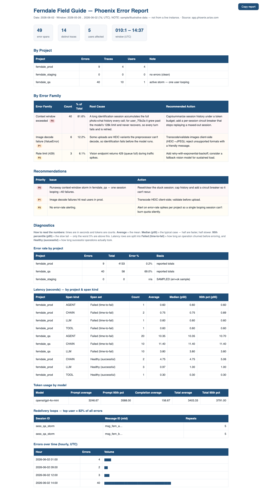

# phoenix-errors

Connect [Arize Phoenix](https://phoenix.arize.com) to Claude as an MCP server, then produce a multi-sheet **error report** from your trace data — invoked as `/phoenix-errors`.

> **What's Phoenix?** [Arize Phoenix](https://phoenix.arize.com) is an open-source LLM-observability / tracing platform — it captures the spans (calls, agents, tools, errors) your AI app emits so you can debug and evaluate them. This skill reads from a Phoenix you're already running; it doesn't instrument your app.



## What it does

Two phases:

1. **Connect (one-time):** Detects whether Phoenix is already connected to Claude. If not, walks you through wiring it into **Claude Desktop** or **Claude Code / Cowork** via `@arizeai/phoenix-mcp` — and, only if you don't have a Phoenix instance yet, helps you stand one up first (**Phoenix Cloud**, **local** pip/docker, or **self-hosted**).
2. **Error report:** Lists your Phoenix projects, lets you check off **one or more** (multi-select), pulls the `ERROR` spans (plus a small healthy sample) in a time window, categorizes them into error families with root cause + prioritized recommendations, and renders:
   - a color-coded **Excel workbook** (`Summary`, `Diagnostics`, `All Errors`, `By Trace`, `By User`, `Recommendations`)
   - a self-contained **HTML summary** with a click-to-copy button

   The **Diagnostics** view adds: error-rate by project, latency (avg/p50/p95 by span-kind, fail vs. healthy), token usage by model, user/session concentration, a **redelivery-loop detector** (same message replayed N×), and errors-over-time.

## Usage

```
/phoenix-errors                  # full flow: detect → (setup) → pick projects → report
/phoenix-errors setup            # force the setup walkthrough
/phoenix-errors my-project       # skip the picker
/phoenix-errors --window 30d     # 24h | 7d | 30d | YYYY-MM-DD..YYYY-MM-DD  (default 7d)
/phoenix-errors --html-only      # or --xlsx-only
```

## Layout

```
phoenix-errors/
├── SKILL.md                    # the skill (runtime pipeline)
├── scripts/build_report.py     # renders xlsx + html from spans.json + analysis.json
├── references/
│   ├── setup.md                # Phoenix install (all 3 flavors) + MCP connect (Desktop/Code)
│   └── data-pull.md            # get-spans usage, attribute mapping, JSON schemas
├── samples/                    # synthetic data + a rendered example report
│   ├── sample_report.png       # ← screenshot shown in this README
│   ├── sample_report.html      # ← what the output looks like (open this)
│   ├── sample_report.xlsx
│   ├── sample_spans.json / sample_ok_spans.json / sample_analysis.json
└── reports/                    # generated reports land here (gitignored — see below)
```

## Sample report

`samples/sample_report.html` / `.xlsx` is a rendered example built from fully synthetic data — a fictional **"Ferndale Field Guide"** app with three projects (a storm in `ferndale_qa`, varied errors in `ferndale_prod`, a clean `ferndale_staging`). Open it to see the Summary, Diagnostics, and per-sheet layout without needing a live Phoenix connection.

## Privacy

Generated reports contain **real customer data** — user IDs, session IDs, message snippets, your Phoenix URL. The `reports/` directory is **gitignored** (only `.gitkeep` is tracked) so reports are never committed. If you need to keep one, move it outside the skill folder. API keys live only in the client config, never in this skill.

## Requirements

- **Node.js / `npx`** — the Phoenix MCP runs as `npx -y @arizeai/phoenix-mcp@latest`.
- **`openpyxl`** (Python) — only for the `.xlsx` output; HTML needs no dependencies.
- A Phoenix instance that's *receiving traces* from your app (instrumentation is out of scope — empty projects mean no traces ingested yet).

> API keys go into the client config (Claude Desktop's `claude_desktop_config.json` or the `claude mcp add` command), never into this skill or anything tracked by git.
